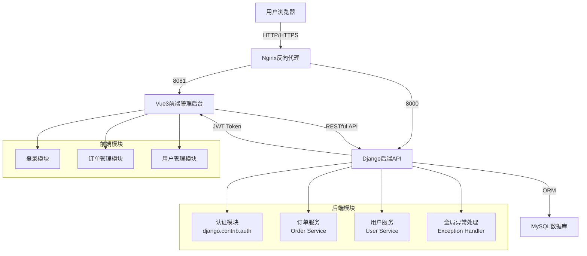
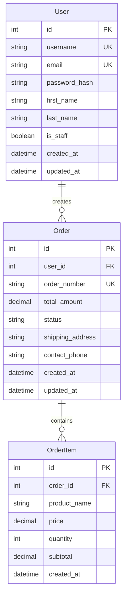

# Django订单管理系统 - 项目设计文档

## 1. 系统架构



## 2. 数据库ER图



## 3. 接口清单

### 3.1 认证模块 (Authentication)

| 方法 | 路径 | 功能 | 权限 |
|------|------|------|------|
| POST | `/api/auth/login/` | 用户登录 | 公开 |
| POST | `/api/auth/logout/` | 用户退出 | 需认证 |
| GET | `/api/auth/user/` | 获取当前用户信息 | 需认证 |

### 3.2 订单管理模块 (Order Management)

| 方法 | 路径 | 功能 | 权限 |
|------|------|------|------|
| GET | `/api/orders/` | 获取订单列表（分页） | 需认证 |
| GET | `/api/orders/{id}/` | 获取订单详情 | 需认证 |
| POST | `/api/orders/` | 创建订单 | 需认证 |
| PUT | `/api/orders/{id}/` | 更新订单 | 需认证 |
| PATCH | `/api/orders/{id}/status/` | 更新订单状态 | 需认证 |
| DELETE | `/api/orders/{id}/` | 删除订单 | 需认证 |

### 3.3 订单项管理 (Order Items)

| 方法 | 路径 | 功能 | 权限 |
|------|------|------|------|
| GET | `/api/orders/{order_id}/items/` | 获取订单项列表 | 需认证 |
| POST | `/api/orders/{order_id}/items/` | 添加订单项 | 需认证 |
| DELETE | `/api/orders/{order_id}/items/{id}/` | 删除订单项 | 需认证 |

## 4. UI/UX 设计规范

### 4.1 色彩系统

- **主色调**: `#409EFF` (Element Plus 默认蓝)
- **成功色**: `#67C23A`
- **警告色**: `#E6A23C`
- **危险色**: `#F56C6C`
- **信息色**: `#909399`

### 4.2 背景与卡片

- **页面背景**: `#F5F7FA` (浅灰)
- **卡片背景**: `#FFFFFF` (白色)
- **卡片阴影**: `0 2px 12px 0 rgba(0, 0, 0, 0.1)`
- **卡片圆角**: `4px`
- **边框颜色**: `#EBEEF5`

### 4.3 字体规范

- **主标题**: `20px`, `#303133`, 加粗
- **副标题**: `16px`, `#606266`
- **正文**: `14px`, `#606266`
- **辅助文字**: `12px`, `#909399`

### 4.4 间距系统

- **基础间距**: `8px` 的倍数
- **卡片内边距**: `20px`
- **组件间距**: `16px`
- **页面边距**: `24px`

### 4.5 交互反馈

- **按钮悬停**: 颜色加深 10%，添加过渡动画
- **Loading状态**: 使用 Element Plus 的 `loading` 指令
- **消息提示**: 使用 `ElMessage` 组件
- **表单验证**: 实时验证，错误信息红色显示

## 5. 技术栈

### 后端
- Django 4.2+
- Django REST Framework
- MySQL 8.0
- JWT 认证 (djangorestframework-simplejwt)
- django-cors-headers (跨域处理)

### 前端
- Vue 3 (Composition API)
- Vite
- Element Plus
- Axios
- Pinia (状态管理)
- Vue Router
- SCSS

## 6. 项目结构

```
.
├── backend/                 # Django后端
│   ├── manage.py
│   ├── requirements.txt
│   ├── Dockerfile
│   ├── config/              # 项目配置
│   │   ├── __init__.py
│   │   ├── settings.py
│   │   ├── urls.py
│   │   └── wsgi.py
│   ├── apps/
│   │   ├── authentication/  # 认证模块
│   │   ├── orders/          # 订单模块
│   │   └── users/           # 用户模块
│   └── utils/               # 工具类
│       ├── exceptions.py    # 全局异常处理
│       └── logging.py       # 日志配置
│
├── frontend-admin/          # Vue3管理后台
│   ├── package.json
│   ├── Dockerfile
│   ├── vite.config.js
│   ├── src/
│   │   ├── api/            # API接口
│   │   ├── store/          # Pinia状态管理
│   │   ├── views/          # 页面视图
│   │   ├── components/     # 组件
│   │   ├── router/         # 路由配置
│   │   └── utils/          # 工具函数
│   └── public/
│
├── docs/                    # 文档目录
│   └── project_design.md
│
├── docker-compose.yml
├── .gitignore
├── README.md
└── schema.sql              # 数据库建表脚本
```

## 7. 安全与健壮性

### 7.1 全局异常处理
- 统一异常响应格式
- 记录异常日志
- 返回友好的错误信息

### 7.2 日志记录
- 关键操作日志（订单创建、更新、删除）
- 用户登录/退出日志
- 异常错误日志

### 7.3 数据验证
- 使用 Django REST Framework Serializer 验证
- 前端表单验证
- 数据库约束

### 7.4 认证与授权
- JWT Token 认证
- Token 刷新机制
- 权限控制（基于用户角色）
